# Exploratory-Data-Analysis-with-Python

**Note:** ***This is a followup on my github repository "Data Wrangling with Python"***

## Introduction

The objective of this project is to perform Exploratory Data Analysis (EDA) on car-related data. By analyzing various characteristics and features, the aim is to determine the factors that significantly impact the pricing of cars.

## Steps

### Choosing the Appropriate Visualization Method

When analyzing individual variables, it's crucial to identify the variable type to select the most suitable visualization technique.

For instance, you can calculate the correlation between variables classified as "int64" or "float64" by using the "corr" method:

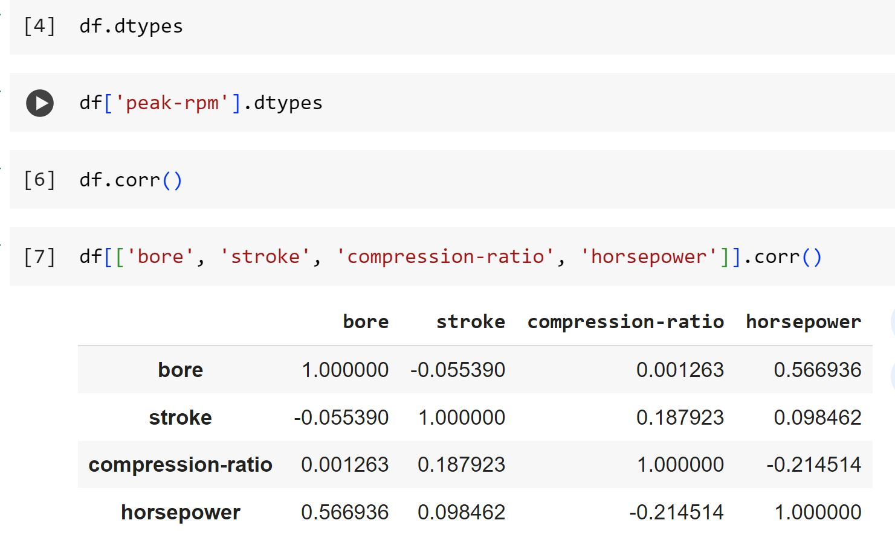

### Continuous Numerical Variables

The process involves analyzing continuous numerical variables using scatterplots with fitted regression lines. It aims to understand the linear relationship between individual variables and price, using "regplot" in Python's visualization libraries.

It showcases examples of different linear relationships:

**1. Positive Linear Relationship:**

Examining the correlation between 'engine-size' and 'price' reveals a direct positive correlation (approximately 0.87). As engine size increases, the price also increases, indicating a strong positive relationship.

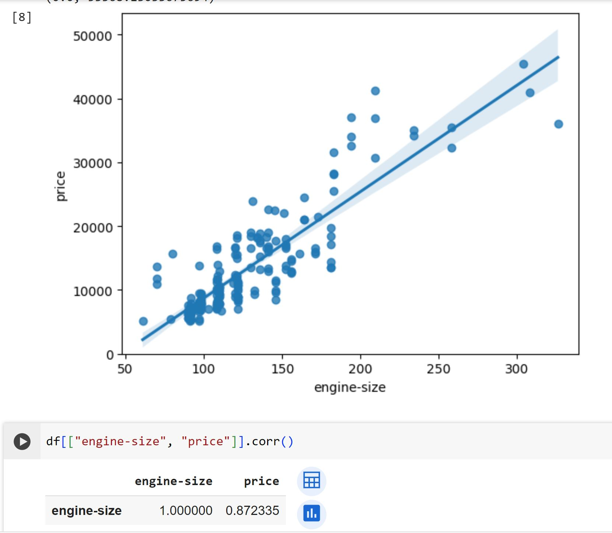

**2. Negative Linear Relationship:**

Evaluating the correlation between 'highway-mpg' and 'price' shows an inverse/negative correlation (approximately -0.704). As highway mpg increases, the price decreases, suggesting a negative relationship.

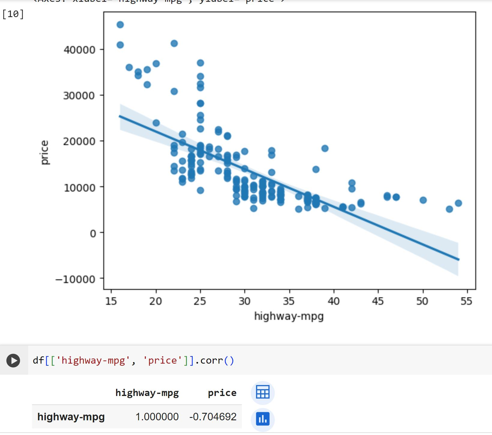

**3. Weak Linear Relationship:**

Assessing 'peak-rpm' as a predictor of 'price' demonstrates a weak and unreliable relationship (correlation approximately -0.101616). The regression line is nearly horizontal, indicating a lack of predictability in price based on peak rpm due to scattered and variable data points.

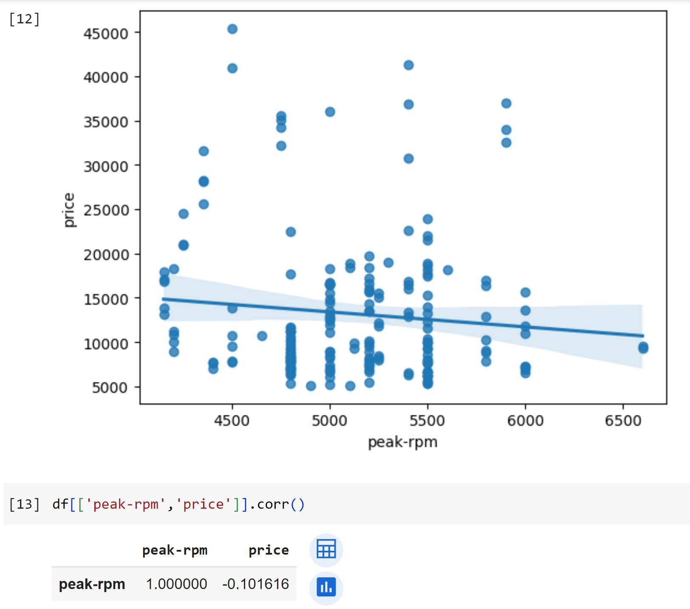

#### Categorical Variables

This process focuses on exploring categorical variables, which represent characteristics selected from specific groups or categories within the dataset. Categorical variables can be of type "object" or "int64", and boxplots are a useful visualization tool for these variables.

**Analyzing "body-style" vs. "price":**

The boxplot indicates an overlap in price distributions among different body-style categories, suggesting that body-style might not be a reliable predictor of price.

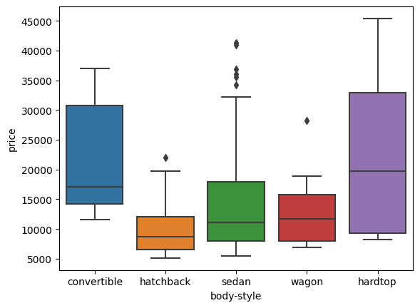

**Investigating "engine-location" vs. "price":**

The boxplot reveals distinct price distributions between front and rear engine-location categories. This distinct difference suggests that engine-location could potentially be a good predictor of price.

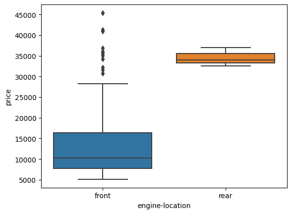

**Evaluating "drive-wheels" vs. "price":**

The boxplot illustrates varying price distributions among different drive-wheels categories. This variation indicates that drive-wheels might serve as a possible predictor of price due to the differences observed in price distribution.

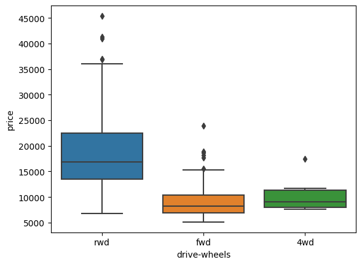

### Descriptive Statistical Analysis

This process focuses on conducting a descriptive statistical analysis of the dataset's continuous variables using the "describe" function. The function automatically calculates basic statistical measures for each continuous variable, excluding any NaN (missing) values. The statistics provided include:

- Count: The number of non-null entries for the variable.
- Mean: The average value of the variable.
- Standard deviation (std): A measure of the dispersion or spread of the data from the mean.
- Minimum value: The smallest value in the dataset.
- IQR (Interquartile Range): Represented by the 25th percentile (Q1), median (50th percentile or Q2), and 75th percentile (Q3). It signifies the range between the first and third quartiles of the data distribution.
- Maximum value: The largest value in the dataset.

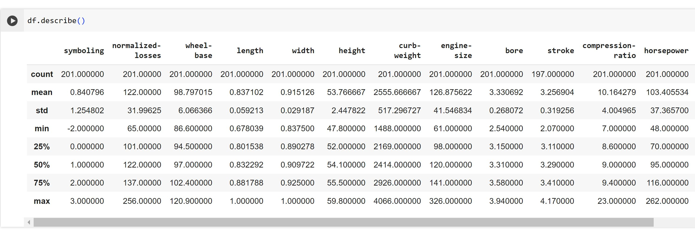

### Value Counts

This process involves utilizing the "value_counts" method to analyze the distribution of different units within a specific characteristic or variable, such as 'drive-wheels.' It is a useful technique for understanding the frequency or count of each unique value in a categorical column.

1

### Basics of Grouping

This process involves using the "groupby" method in pandas to group data based on specific categories or variables and then performing analysis within those groups.

Initially, the data is grouped by a certain variable, and calculations like finding averages or other aggregate functions are applied. For instance, if you want to determine the average price of different types of drive wheels, you can group the data by 'drive-wheels' and calculate the mean price for each category.

Grouping can also be performed based on multiple variables simultaneously. By combining 'drive-wheels' and 'body-style', for instance, you create unique groups representing different combinations of these variables.

The grouped data is then transformed into a pivot table, resembling an Excel spreadsheet. This pivot table arrangement helps in visualizing relationships between variables. For example, converting 'drive-wheels' into rows and 'body-style' into columns allows us to understand how the price relates to these variables.

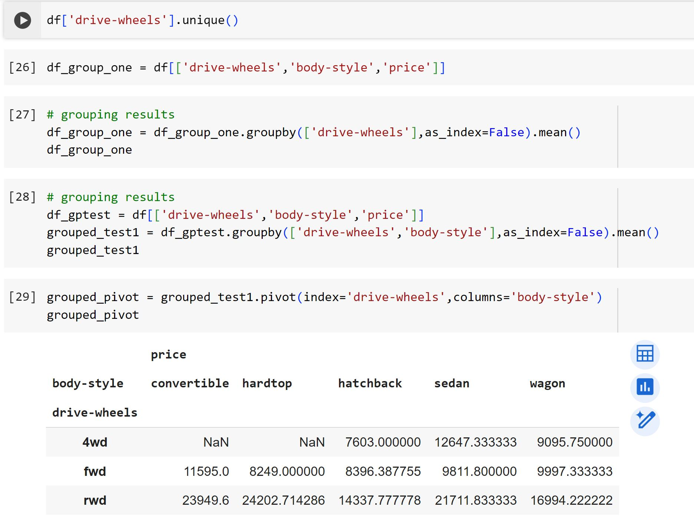

Finally, a heatmap is used to graphically represent the relationship between 'Body Style vs Price'. The color shading on the heatmap indicates the price concerning 'drive-wheel' and 'body-style', allowing for an intuitive visualization of their correlation.

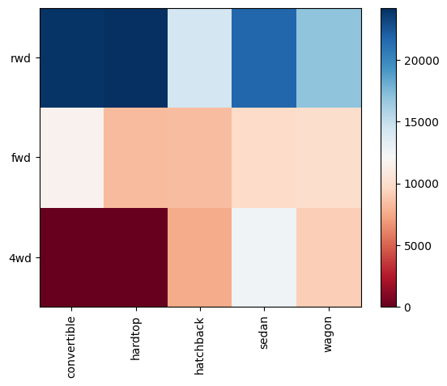

### Correlation and Causation

This process deals with understanding the correlation and causation between variables.

**Correlation** signifies the degree of interdependence between variables, whereas **causation** indicates the cause-and-effect relationship between two variables. It's essential to differentiate between them as correlation doesn't imply causation. Establishing causation might require independent experimentation, making it more complex than determining correlation.

Pearson Correlation measures the linear dependence between two variables, giving a coefficient value between -1 and 1:

- -1: Perfect negative linear correlation.
- 0: No linear correlation, suggesting no effect on each other.
- 1: Perfect positive linear correlation.

The Pearson Correlation is computed using the "corr" function, evaluating the 'int64' or 'float64' variables.

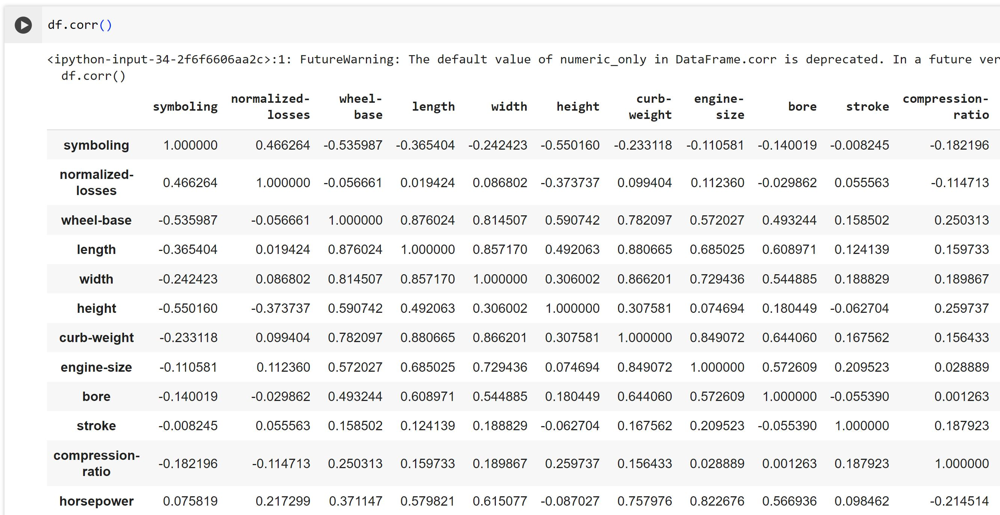

The **p-value** assesses the statistical significance of the correlation between variables. Typically, a significance level of 0.05 is chosen, indicating a 95% confidence level that the correlation between variables is significant. Interpretations based on p-values:

- 0.001: Strong evidence of significant correlation.
- 0.05: Moderate evidence of significant correlation.
- 0.1: Weak evidence of significant correlation.
- 0.1 or higher: Indicates no evidence of significant correlation.

The "stats" module in the "scipy" library is used to obtain this statistical information.

The Pearson Correlation Coefficient and p values where calculated for various variables vs price.

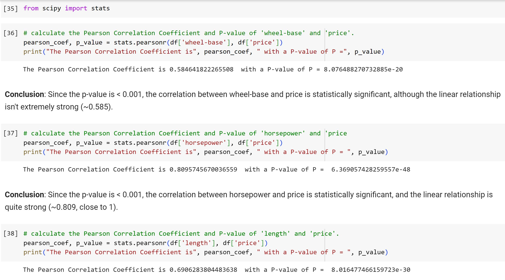

## Conclusion

After analyzing the data, we've identified crucial variables that significantly impact predicting car prices. We've categorized these variables into two groups:

**Continuous numerical variables**:

- Length
- Width
- Curb-weight
- Engine-size
- Horsepower
- City-mpg
- Highway-mpg
- Wheel-base
- Bore

**Categorical variables**:

- Drive-wheels
